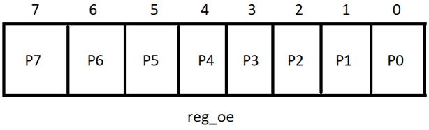
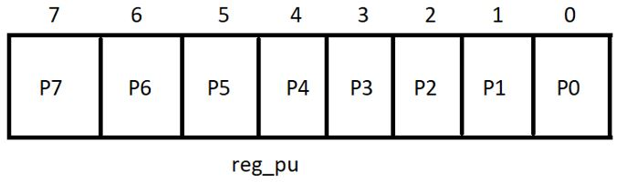
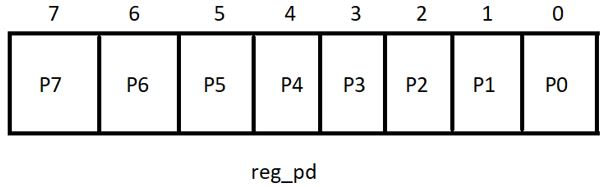
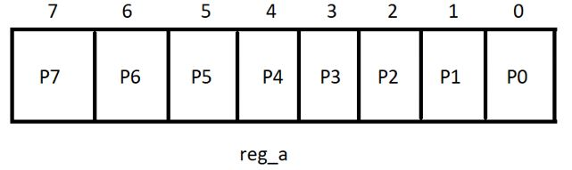
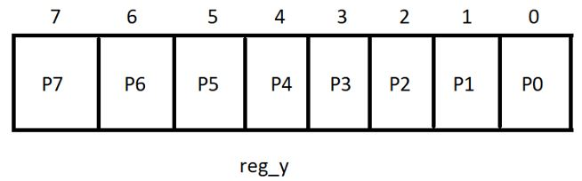

# Описание регистров.

| Регистры | Адрес | Сброс | Разрешение |
| -------- | ----- | ----- | ---------- |
| reg_oe   | 0x00  | 0x00  |  R/W       |
| reg_pu   | 0x01  | 0x00  |  R/W       |
| reg_pd   | 0x02  | 0x00  |  R/W       |
| reg_a    | 0x03  | 0x00  |  R/W       |
| reg_a    | 0x04  | 0x00  |  R         |

## Регистр reg_oe.
> Регистр reg_oe используется для установки направлений портов. Это 8-битный регистр, где каждый бит соответствует порту. Бит 0 соответствует P0, бит 1 соответствует P1 и т. д. Установка бита в соответствующем регистре конфигурации включает соответствующий порт в качестве входа. Аналогичным образом, сброс бита в регистре конфигурации включает соответствующий порт в качестве выхода.

| Регистры | Адрес | Длина | Разрешение | Описание |
| -------- | ----- | ----- | ---------- |  ------- |
| reg_oe   | 0x00  | 8     |  R/W       |    «1» настраивает порт как вход; «0» настраивает порт как выход.|

## Регистр reg_pu.

> Регистр reg_pu используется для включения встроенной резистивной подтяжки к питанию. Это 8-битный регистр, где каждый бит соответствует порту. Бит 0 соответствует P0, бит 1 соответствует P1 и т. д. Установка бита в соответствующем регистре конфигурации подтягивает на соответствующий порт резистивную подтяжку к питанию. Аналогичным образом, сброс бита в регистре конфигурации отключает от соответствующего порта резистивную подтяжку.

| Регистры | Адрес | Длина | Разрешение | Описание |
| -------- | ----- | ----- | ---------- |  ------- |
| reg_pu   | 0x01  | 8     |  R/W       |    Включение встроенной резистивной подтяжки к питанию. «1» подтяжка включена; «0» подтяжка выключена. |

## Регистр reg_pd.
> Регистр reg_pd используется для включения встроенной резистивной подтяжки к земле. Это 8-битный регистр, где каждый бит соответствует порту. Бит 0 соответствует P0, бит 1 соответствует P1 и т. д. Установка бита в соответствующем регистре конфигурации подтягивает на соответствующий порт резистивную подтяжку к земле. Аналогичным образом, сброс бита в регистре конфигурации отключает от соответствующего порта резистивную подтяжку.

| Регистры | Адрес | Длина | Разрешение | Описание |
| -------- | ----- | ----- | ---------- |  ------- |
| reg_pd   | 0x02  | 8     |  R/W       |    Включение встроенной резистивной подтяжки к земле. «1» подтяжка включена; «0» подтяжка выключена. |

## Регистр reg_a.
> Регистр reg_a используется для перевода портов в состояние высокого или низкого уровня. Это 8-битный регистр, где каждый бит соответствует порту. Бит 0 соответствует P0, бит 1 соответствует P1 и т. д. Запись единицы в определенный бит этого регистра выставляет высокий логический уровень на этом порту. Запись нуля в определенный бит этого регистра выставляет низкий логический уровень на этом порту.

| Регистры | Адрес | Длина | Разрешение | Описание |
| -------- | ----- | ----- | ---------- |  ------- |
| reg_a   | 0x03  | 8     |  R/W       |   «1» выставляет высокий уровень; «0» выставляет низкий уровень.|

## Регистр reg_y.
> Регистр reg_y используется для чтения значений на определенных выводах. Это 8-битный регистр, где каждый бит соответствует порту. Бит 0 соответствует P0, бит 1 соответствует P1 и т. д. Этот регистр доступен только для чтения.

| Регистры | Адрес | Длина | Разрешение | Описание |
| -------- | ----- | ----- | ---------- |  ------- |
| reg_y   | 0x04  | 8     |  R       |   Регистр для чтения значений на выводах.|

